# 🚪 KnockIn (프로그라피 11기 1팀 백엔드)

> **"나와 딱 맞는 룸메이트를 쉽고 빠르게"**  
> 프로그라피 11기 1팀의 룸메이트 매칭 서비스 **KnockIn** 백엔드 애플리케이션 레포지토리입니다.

---

## 🛠️ Tech Stack (기술 스택)

### Core Framework & Language
- **Language**: Java 21
- **Framework**: Spring Boot 4.0.5
- **Build Tool**: Gradle 8.x

### Database & ORM
- **Database**: PostgreSQL (Production - Supabase), H2 Database (Local / Test)
- **ORM**: Spring Data JPA
- **Query Engine**: QueryDSL 6.11 (`io.github.openfeign.querydsl`)

### Security & Authentication
- **Security**: Spring Security, Spring OAuth2 Client
- **Authentication**: JWT (JSON Web Token - `jjwt 0.12.6`), OAuth2 (Kakao, Apple 소셜 로그인 및 연동 해제)

### Real-Time & Communications
- **Real-Time Communication**: Spring WebSocket & STOMP (양방향 실시간 채팅)
- **Real-Time Streaming**: SSE (Server-Sent Events - `SseEmitter` 기반 단방향 실시간 알림 스트리밍)
- **Push Notification**: Firebase Cloud Messaging (FCM Admin SDK 9.9.0)
- **Email Service**: Resend API (4.11.0), Svix Webhook (1.44.0)

### Cloud & Storage
- **File Storage**: Cloudflare R2 (AWS S3 Java SDK v2 v2.28.23 호환)

### Documentation & DevOps
- **API Documentation**: Springdoc OpenAPI 3.x (Swagger UI)
- **CI/CD**: GitHub Actions, AWS EC2, `git-crypt`

---

## 📌 Key Features (주요 기능)

### 1. 🔍 룸메이트 매칭 & 조건 필터링 (Roommate Matching)
- **QueryDSL 동적 쿼리**: 성별, 예산(보증금/월세), 방 형태, 위치, 입주 가능일 등 다양한 다중 조건 필터링
- **매칭 점수 알고리즘 (`RoommateScoreService`)**: 생활 패턴(기상/수면 시간, 청소 주기, 흡연, 음주, 수면 습관 등) 및 선호도 기반 룸메이트 적합도 점수(0~100점) 실시간 산출

### 2. 💬 실시간 WebSocket / STOMP 채팅 (Real-Time Chatting)
- STOMP 프로토콜 기반 1:1 룸메이트 매칭 요청 및 채팅방 생성/입장/퇴장
- WebSocket 핸드셰이크 및 세션 인증 인터셉터 (`StompAuthenticationChannelInterceptor`) 적용
- 채팅방 내부 이미지 및 파일 첨부 업로드 지원

### 3. 🔑 소셜 로그인 & 보안 (Security & Authentication)
- OAuth2 (Kakao / Apple) 기반 소셜 로그인 및 회원 탈퇴(OAuth2 토큰 취소/연동 해제) 지원
- JWT Access / Refresh Token 기반 무상태(Stateless) 보안 아키텍처
- 이메일 인증 코드 발급 및 검증 (Resend API 활용)

### 4. 🔔 푸시 & SSE 실시간 알림 (Notification System)
- **SSE (Server-Sent Events) 스트리밍**: Spring `SseEmitter` 기반 실시간 인앱 알림 구독 (`GET /alarms/subscribe`) 및 이벤트 전송
- **FCM (Firebase Cloud Messaging)**: 모바일 백그라운드/포그라운드 푸시 알림
- **알림 제어**: 사용자별 알림 수신 설정 (Notification Setting) 및 전체 읽음 처리 지원

### 5. 🛠️ 백오피스 & 서비스 관리 (Backoffice BO)
- 사용자 신고(Declaration), 차단(Block), 회원 탈퇴 처리
- 공지사항, FAQ, 약관(Terms) 및 서비스 메타데이터 관리 API
- 탈퇴 사용자 자동 정리를 위한 배치 스케줄러 (`MemberDeleteScheduler`)

---

## 📊 Entity Relationship Diagram (ERD)

KnockIn 프로젝트의 **총 75개 JPA 엔티티**는 기능 단위별로 9개 도메인 블록으로 구성되어 있습니다.

```mermaid
flowchart TD
    %% Direction Top to Down (수직 정렬)

    %% ==========================================
    %% COLUMN 1: MEMBER, BOARD, ALARM
    %% ==========================================
    subgraph D1 ["👤 1. Member & Auth Domain (회원 및 인증)"]
        direction TB
        MEMBER["Member (회원)"]
        BASIC_INFO["BasicInformation (기본 프로필)"]
        PRIVACY["MemberPrivacy (개인정보)"]
        PREF_COND["PreferenceCondition (선호 조건)"]
        AUTH["Authentication (본인 인증)"]
        BLOCK["Block (차단)"]

        MEMBER -->|1:1| BASIC_INFO
        MEMBER -->|1:1| PRIVACY
        MEMBER -->|1:1| PREF_COND
        MEMBER -->|1:N| AUTH
        MEMBER -->|1:N| BLOCK
    end

    subgraph D4 ["📋 4. Board & Backoffice (게시글 & 약관)"]
        direction TB
        BOARD["RoommateBoard (룸메 게시글)"]
        BOARD_INTEREST["RoommateBoardInterest (좋아요)"]
        INQUIRY["Inquiry (1:1 문의)"]
        AGREEMENT["Agreement (이용약관)"]
        MEMBER_AGREE["MemberAgreement (회원 동의)"]

        MEMBER -->|1:N| BOARD
        BOARD -->|1:N| BOARD_INTEREST
        MEMBER -->|1:N| INQUIRY
        AGREEMENT -->|1:N| MEMBER_AGREE
        MEMBER -->|1:N| MEMBER_AGREE
    end

    subgraph D7 ["🔔 7. Alarm & Notification (알림 & 푸시)"]
        direction TB
        ALARM["Alarm (수신 알림)"]
        ALARM_SETTING["AlarmSetting (알림 설정)"]
        NOTIFICATION["Notification (FCM 푸시)"]

        MEMBER -->|1:N| ALARM
        MEMBER -->|1:N| ALARM_SETTING
        MEMBER -->|1:N| NOTIFICATION
    end

    %% ==========================================
    %% COLUMN 2: LIFE PATTERN, CHATTING, PAYMENT
    %% ==========================================
    subgraph D2 ["🧬 2. Life Pattern & Scoring (생활패턴 & 점수)"]
        direction TB
        LIFE_PATTERN["LifePattern (생활패턴)"]
        MEMBER_LP["MemberLifePattern (회원 패턴)"]
        PREF_WEIGHT["PreferenceConditionWeight (가중치)"]

        LIFE_PATTERN -->|1:N| MEMBER_LP
        MEMBER -->|1:N| MEMBER_LP
        MEMBER -->|1:N| PREF_WEIGHT
    end

    subgraph D5 ["💬 5. Real-Time Chatting (실시간 STOMP 채팅)"]
        direction TB
        CHAT_REQ["ChattingRequired (대화 신청)"]
        CHAT_ROOM["ChattingRoom (채팅방)"]
        CHAT_MSG["ChatRoomMessage (전송 메시지)"]

        BOARD -->|1:N| CHAT_REQ
        CHAT_REQ -->|1:1| CHAT_ROOM
        CHAT_ROOM -->|1:N| CHAT_MSG
    end

    subgraph D8 ["💳 8. Payment & File System (결제 & 파일)"]
        direction TB
        PAYMENT["Payment (결제)"]
        POINT["Point (포인트)"]
        FILE_SYSTEM["File (첨부 파일)"]

        MEMBER -->|1:N| PAYMENT
        MEMBER -->|1:N| POINT
    end

    %% ==========================================
    %% COLUMN 3: ROOM PROFILE, ROOMMATE & CALENDAR
    %% ==========================================
    subgraph D3 ["🏠 3. Room & Search Profile (방 프로필 & 조건)"]
        direction TB
        ROOM_PROFILE["RoomProfile (방 프로필)"]
        OFFER_PROFILE["RoomOfferProfile (제공 상세)"]
        SEEKER_PROFILE["RoomSeekerProfile (구하는 조건)"]
        ROOM_TYPE["RoomType (방 형태)"]
        REGION["Region (지역)"]

        MEMBER -->|1:N| ROOM_PROFILE
        MEMBER -->|1:1| SEEKER_PROFILE
        ROOM_TYPE -->|1:N| ROOM_PROFILE
        REGION -->|1:N| ROOM_PROFILE
        ROOM_PROFILE -->|1:1| OFFER_PROFILE
    end

    subgraph D6 ["🤝 6. Matched Roommate & Calendar (매칭 & 일정)"]
        direction TB
        MY_ROOMMATE["MyRoommate (매칭 룸메)"]
        ROOMMATE_SCORE["RoommateScore (적합도 점수)"]
        CALENDAR["RoommateCalendar (공유 일정)"]

        MEMBER -->|1:N| MY_ROOMMATE
        MEMBER -->|1:N| ROOMMATE_SCORE
        MY_ROOMMATE -->|1:N| CALENDAR
    end

    %% Column vertical flows (Force Top-Down Grid Layout)
    D1 ~~~ D4 ~~~ D7
    D2 ~~~ D5 ~~~ D8
    D3 ~~~ D6
```


<details>
<summary><b>📐 전체 도메인 별 Mermaid ERD 다이어그램 (수직 수평 밸런스 3x3 레이아웃) 펼쳐보기</b></summary>


</details>

---

## 📁 Directory Structure (프로젝트 구조)

```text
src/main/java/org/example/knockin
├── auth          # OAuth2(Kakao/Apple) 소셜 로그인, JWT 토큰 관리 및 인증 필터
├── batch         # 회원 탈퇴 등 자동 정리 배치 스케줄러
├── config        # Security, QueryDSL, WebSocket/STOMP, FCM, Resend, S3 등 전역 설정
├── controller    # REST API 컨트롤러 및 WebSocket STOMP 메시지 매핑
├── dto           # 요청/응답 Data Transfer Object
├── entity        # JPA 도메인 엔티티 (회원, 게시글, 채팅, 알림, 약관 등)
├── global        # 공통 예외 처리, ApiResponse 래퍼, 유틸리티
├── repository    # Spring Data JPA 및 QueryDSL 커스텀 리포지토리
└── service       # 비즈니스 로직 및 인터페이스 구현체
```

---

## 🚀 Local Setup & Run (로컬 실행 가이드)

### 1. 🔑 SSL/HTTPS 로컬 Keystore 발급 (선택)
로컬 환경에서 HTTPS 및 OAuth2 소셜 로그인 검증을 수행하려면 `ssl/` 디렉터리의 `key.pem`과 `cert.pem`을 PKCS12 Keystore 파일로 변환합니다:

```bash
openssl pkcs12 -export -out keystore.p12 -inkey ssl/key.pem -in ssl/cert.pem -name springboot
```

> **Note**: 생성된 `keystore.p12` 파일은 `src/main/resources/` 경로로 이동시키거나 설정 파일에서 경로를 지정합니다.

### 2. 🧪 Gradle 빌드 및 테스트 실행
```bash
# 기본 단위/통합 테스트 및 프로젝트 빌드 (동시성/성능 테스트 제외)
./gradlew clean build

# 일반 테스트 실행
./gradlew test

# 동시성 테스트 실행
./gradlew concurrencyTest

# 성능 테스트 실행
./gradlew performanceTest
```

### 3. ▶️ 애플리케이션 실행
```bash
# 로컬 개발 서버 실행 (기본 test 프로필 또는 지정 프로필)
./gradlew bootRun

# 특정 프로필로 실행 (예: prod)
./gradlew bootRun --args='--spring.profiles.active=prod'
```

---

## 🔗 Main Endpoints & Documentation

- **Swagger API Docs**: `http://localhost:8080/swagger-ui/index.html`
- **H2 Console (Local)**: `http://localhost:8080/h2-console`